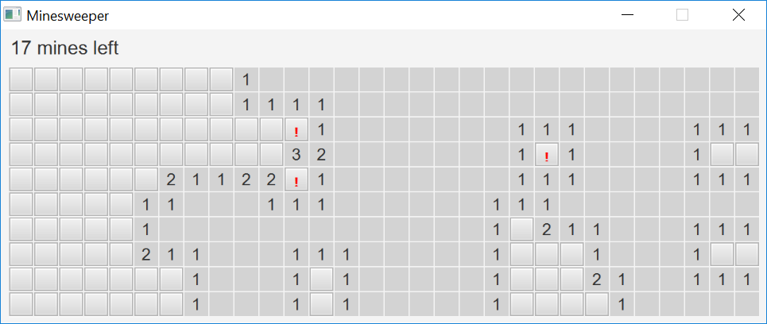

# Campo minato

Scritto da Martin P. Robillard e adattato per il corso di "Programmazione II" @
Unimi.

## Esercizi

Dopo aver importato il progetto con in IntelliJ IDEA, studiare il codice
dell'applicazione e svolgere i seguenti esercizi.

### Familiarizzare con la documentazione e l'IDE

- Reperire la documentazione di base dei tipi `Insets` e `Stage` (suggerimento:
  Quick Documentation)
- Reperire la documentazione di `String`
- Reperire online la documentazione di JavaFX 13
  
### Analizzare gli oggetti in gioco

- Quanti oggetti `Cell` vengono istanziati?
- Quanti oggetti `Position` vengono istanziati? Come si può fare per contarli
  esattamente?
- Quali Responsabilità e Collaborazioni gestisce `Cell`?
- Quali Responsabilità e Collaborazioni gestisce `Position`?
- Quali Responsabilità e Collaborazioni gestisce `Minefield`?

### Nuove funzionalità

Modificare il programma in modo che 

- Premendo il tasto `r` s ricominci (come già succede con `enter`)
- Cliccando con il tasto destro su una cella la si marca in giallo (oltre al
  punto esclamativo e alla diminuzione del numero di mine nascoste)
- Schiacciando `s` si scoprano tutte le celle
- Schiacciando `h` si ottenga un suggerimento (cioè la segnalazione di una cella
  sicuramente libere, se è possibile determinarne una dalle informazioni
  disponibili al giocatore)
- Aggiungere alle responsabilità della classe `Minefield` la gestione dello
  spazio dei suoi stati possibili (cioè `NOT_CLEARED`, `CLEARED`, `EXPLODED`)
- Associare la rappresentazione della cella ("X", " ") allo stato della cella
  stessa (`isMined` o `!isMined`)

