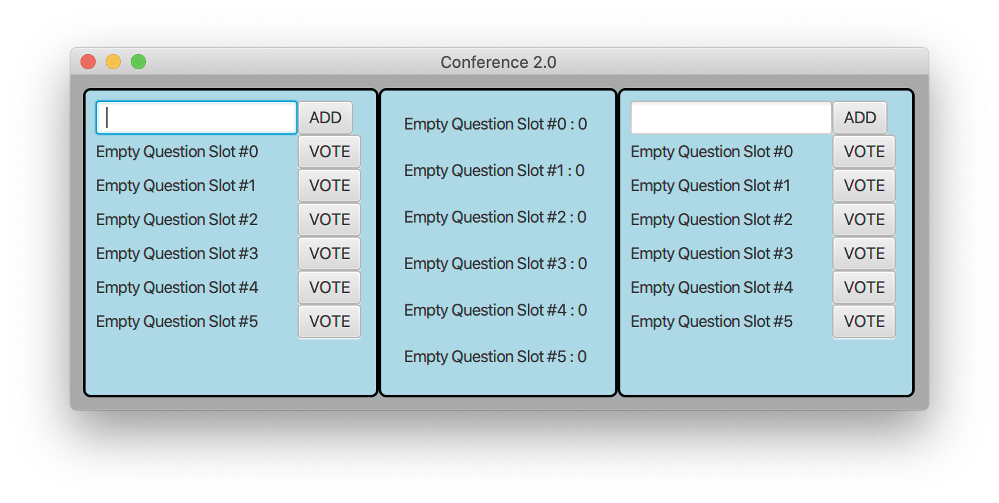

# Domande online

Obiettivo dell'esercizio è progettare e realizzare un insieme di classi atte a produrre un semplice
programma Java che si occupi di gestire un sistema di moderazione domande (per semplicità il numero
di domande totali è fissato a sei).

Vengono fornite due *Viste* del sistema:

- `PersonalView`: la vista personale del partecipante (che permette di definire e votare le domande)
- `GeneralDisplayView`: il display generale che presenta le domande in ordine di numero dei voti

Viene fornita anche una classe `Main` che permette d'istanziare la parte statica delle due viste, e
una classe  `PersonalViewPresenter`.

**TUTTE LE CLASSI DATE POSSONO ESSERE DA VOI MODIFICATE PER ADERIRE A VOSTRE IDEE DI PROGETTAZIONE
E/O COMPLETATE**

Lanciando il programma (tramite il task `run` di gradle) si ottiene una interfaccia come quella
nella figura sottostante.

Allo stato attuale, la parte già implementata fa sì che:

- Quando si preme il bottone "ADD" viene chiamato il metodo del *presenter* `addQuestion(String)`.
- Quando si preme il bottone "VOTE" viene chiamato il metodo del *presenter* `voteQuestion(int)`.

## TRACCIA

Completare, in modo da realizzare un'organizzazione del sistema di tipo Model-View-Presenter, le
classi già presenti (`Main`, `PersonalViewPresenter`) e aggiungere le classi
necessarie (`QuestionModel`,
`GeneralViewPresenter`, etc.) in modo che:

- se non sono state già definite sei domande alla pressione del tasto "ADD" venga aggiunta la
  domanda presente nel relativo campo di testo;
- quando viene premuto un tasto "VOTE", venga incrementato il punteggio relativo alla corrispondente
  domanda (se definita);
- la vista generale presenti le domande in ordine di punteggio dei voti;
- le viste rimangano sincronizzate sulle domande (tramite il modello).

## ALTRE RICHIESTE E DOMANDA

Vi abbiamo al momento fornito solo classi concrete, qualora lo riteneste utile per un buon design
potete introdurre astrazioni (interfacce o classi astratte), corredando l'aggiunta con la
spiegazione del perché i cambiamenti effettuati migliorano il progetto. Nel caso, invece, non
riteneste opportuno l'uso di ulteriori interfacce e classi astratte, motivate questa scelta.

## CONSEGNA

Creare uno file `.zip` il contenuto della directory `src` e il file contenente la risposta alla
domanda.

Spedire tale file in una chat MS Teams privata al prof. Bellettini. In caso di più spedizioni, verrà
considerata l'ultima (tra quelle arrivate entro i limiti di tempo della prova).

