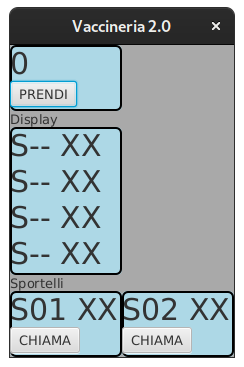

# Vaccinazioni COVID

Obiettivo dell'esercizio è progettare e realizzare un insieme di classi
atte a produrre un semplice programma Java che si occupi di gestire l'accettazione 
dell'ospedale per le vaccinazioni COVID.

Vengono fornite tre *Viste* del sistema:
- il distributore dei biglietti (pulsante + display)
- lo sportello (pulsante + display)
- il display generale

Per uniformità tutte e tre le classi implementano l'interfaccia `TicketView`.

Viene fornita anche una classe `Main`  che permette d'istanziare 
la parte statica delle tre viste, e una classe astratta Presenter.

**TUTTE LE CLASSI DATE POSSONO ESSERE DA VOI MODIFICATE PER ADERIRE A VOSTRE IDEE DI PROGETTAZIONE E/O COMPLETATE**

Ad esempio le classi `Main` e  `GeneralDisplayView` sono chiaramente incomplete (nella inizializzazione del sistema l'una, nel metodo `set` l'altra)

Lanciando il programma (tramite il task `run` di gradle) dovreste riuscire a 
ottenere una interfaccia come quella nella figura sottostante.

Quando si preme il bottone "PRENDI" del distributore (`GetTicketView`), 
viene incrementato il numero del biglietto.

Quando si preme il bottone "CHIAMA" di uno sportello (`FrontOfficeView`), 
il prossimo numero da servire (se esiste) viene segnalato sul display dello
sportello stesso (non vengono modificati i display degli altri sportelli).
La scritta del display sportello è nel formato "Snn mm" dove *nn* è il numero 
identificativo dello sportello e *mm* è il numero del biglietto che si deve 
presentare allo sportello.

Il display generale (`GeneralDisplayView`) in ogni istante presenta gli ultimi 
quattro numeri chiamati (partendo dall'ultimo chiamato) e in quali sportelli sono stati chiamati.
La scritta del display è formata da quattro righe, ognuna in formato analogo a quello 
presentato sul display degli sportelli.

Potete usare uno schema Model-View-Controller o Model-View-Presenter (a vostra scelta).

Ponete particolare attenzione alla scelta di dove memorizzare gli ultimi quattro 
numeri/sportelli chiamati: nella vista, nel presenter/controller o nel modello.

## DOMANDA DI TEORIA

Motivare tale scelta (posizionamento stato ultimi 4 numeri chiamati) anche relazionandola alla variante di pattern adottata.

## CONSEGNA

Creare uno file .zip il contenuto della directory src e il file contenente la risposta alla domanda.

Spedire tale file in una chat Teams privata al professore. In caso di più spedizioni, verrà considerata l'ultima
(tra quelle arrivate entro i limiti di tempo della prova).

